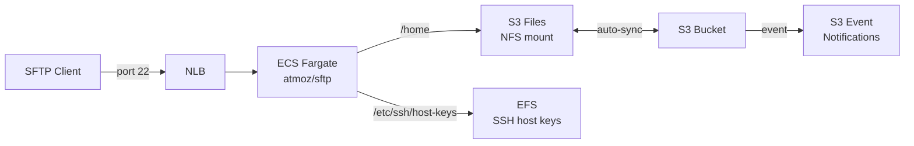

# Terraform AWS S3 Files SFTP

A Terraform module that deploys a fully working SFTP server on ECS Fargate, backed by **S3** via [AWS S3 Files](https://docs.aws.amazon.com/AmazonS3/latest/userguide/s3-files.html). An ~8x cheaper alternative to AWS Transfer Family for most SFTP use cases.

Files uploaded via SFTP land in S3 within seconds, enabling S3 event notifications, lifecycle rules, replication, and all other S3 features.

## Architecture



## Prerequisites

- **Terraform >= 1.11** with **AWS provider >= 6.41**.
- An **S3 bucket with versioning enabled** (you create it, the module takes its ARN).
- A VPC with public and private subnets.

This module is fully native Terraform — no AWS CLI or external tools required.

## Usage

```hcl
resource "aws_s3_bucket" "sftp" {
  bucket = "my-sftp-bucket"
}

resource "aws_s3_bucket_versioning" "sftp" {
  bucket = aws_s3_bucket.sftp.id
  versioning_configuration { status = "Enabled" }
}

module "sftp" {
  source  = "psantus/s3files-sftp/aws"

  aws_region         = "us-east-1"
  env                = "dev"
  vpc_id             = "vpc-0123456789abcdef0"
  public_subnet_ids  = ["subnet-aaa", "subnet-bbb"]
  private_subnet_ids = ["subnet-ccc", "subnet-ddd"]
  s3_bucket_arn      = aws_s3_bucket.sftp.arn
  sftp_users         = "myuser:mypassword:1000:1000:upload"
}

output "sftp_endpoint" {
  value = module.sftp.sftp_endpoint
}
```

Then connect:

```bash
sftp -P 22 myuser@<sftp_endpoint>
```

## SSH key authentication

atmoz/sftp supports SSH key auth. Upload public keys to the S3 bucket at `<user>/.ssh/keys/`:

```hcl
resource "aws_s3_object" "user_ssh_key" {
  bucket  = aws_s3_bucket.sftp.id
  key     = "myuser/.ssh/keys/id_rsa.pub"
  content = file("~/.ssh/id_rsa.pub")
}
```

Users with an empty password in `sftp_users` (e.g. `myuser::1000:1000:upload`) can only authenticate via SSH key. You can mix password and key-based users in the same spec.

## Inputs

| Name | Description | Type | Default | Required |
|------|-------------|------|---------|----------|
| `aws_region` | AWS region | `string` | — | yes |
| `env` | Environment name (e.g. dev, prod) | `string` | — | yes |
| `vpc_id` | VPC ID | `string` | — | yes |
| `public_subnet_ids` | Subnets for the NLB | `list(string)` | — | yes |
| `private_subnet_ids` | Subnets for ECS tasks and mount targets | `list(string)` | — | yes |
| `s3_bucket_arn` | ARN of the S3 bucket (must have versioning enabled) | `string` | — | yes |
| `project_name` | Prefix for resource names | `string` | `"s3files-sftp"` | no |
| `sftp_users` | atmoz/sftp user spec (`user:pass:uid:gid:dir`) | `string` | `"demo:demo:1000:1000:upload"` | no |
| `logs_retention_in_days` | CloudWatch log retention | `number` | `7` | no |
| `route53_zone_id` | Route53 zone ID for DNS record | `string` | `""` | no |
| `sftp_dns_name` | DNS name for the SFTP endpoint | `string` | `""` | no |
| `allowed_cidr_blocks` | CIDR blocks allowed to connect to the SFTP endpoint | `list(string)` | `["0.0.0.0/0"]` | no |
| `min_capacity` | Minimum number of SFTP tasks | `number` | `1` | no |
| `max_capacity` | Maximum number of SFTP tasks | `number` | `4` | no |
| `alarm_sns_topic_arn` | SNS topic ARN for CloudWatch alarm notifications | `string` | `""` | no |

## Outputs

| Name | Description |
|------|-------------|
| `sftp_endpoint` | NLB DNS name for SFTP connections |
| `s3files_file_system_id` | S3 Files file system ID |
| `s3files_file_system_arn` | S3 Files file system ARN |

## How it works

1. You provide an **S3 bucket** (versioned) — the module attaches an S3 Files file system to it.
2. An **S3 Files file system** provides an NFS interface to the bucket, mounted on Fargate tasks at `/home`.
3. An **EFS volume** persists SSH host keys so the server fingerprint is stable across task restarts and scaling.
4. **[atmoz/sftp](https://github.com/atmoz/sftp)** runs on Fargate behind a Network Load Balancer with source IP stickiness.
5. Files uploaded via SFTP sync to S3 automatically — wire up S3 event notifications for downstream processing.

## Cost comparison vs AWS Transfer Family

| Component | Transfer Family | This module |
|---|---|---|
| Base cost | $0.30/hr (~$216/mo) | NLB: ~$16/mo |
| Compute | Included | Fargate 0.25 vCPU / 512MB: ~$9/mo |
| Storage | S3 pricing | S3 pricing (same) |
| **Monthly minimum** | **~$216** | **~$25** |

## License

MIT
