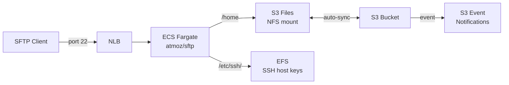

# Terraform AWS S3 Files SFTP

A Terraform module that deploys a fully working SFTP server on ECS Fargate, backed by **S3** via [AWS S3 Files](https://docs.aws.amazon.com/AmazonS3/latest/userguide/s3-files.html). An ~8x cheaper alternative to AWS Transfer Family for most SFTP use cases.

Files uploaded via SFTP land in S3 within seconds, enabling S3 event notifications, lifecycle rules, replication, and all other S3 features.

## Architecture



## Prerequisites

- **AWS CLI v2.34.26+** — required for `aws s3files` commands. Update with `brew upgrade awscli` or see [install guide](https://docs.aws.amazon.com/cli/latest/userguide/getting-started-install.html).
- **[jq](https://jqlang.github.io/jq/)** — used by provisioner scripts to parse AWS CLI JSON output.
- **Terraform >= 1.5**
- A VPC with public and private subnets.

## Why not native Terraform?

The Terraform AWS provider doesn't support `aws_s3files_file_system` yet ([PR #47325](https://github.com/hashicorp/terraform-provider-aws/pull/47325)). S3 Files resources and the ECS task definition (which needs `s3filesVolumeConfiguration`) are managed via `terraform_data` + AWS CLI provisioners. This module will be updated to use native resources once the provider ships support.

## Usage

```hcl
module "sftp" {
  source  = "psantus/s3files-sftp/aws"

  aws_region         = "us-east-1"
  env                = "dev"
  vpc_id             = "vpc-0123456789abcdef0"
  public_subnet_ids  = ["subnet-aaa", "subnet-bbb"]
  private_subnet_ids = ["subnet-ccc", "subnet-ddd"]
  sftp_users         = "myuser:mypassword:1000:1000:upload"
}

output "sftp_endpoint" {
  value = module.sftp.sftp_endpoint
}
```

Then connect:

```bash
sftp -P 22 myuser@<sftp_endpoint>
```

## Inputs

| Name | Description | Type | Default | Required |
|------|-------------|------|---------|----------|
| `aws_region` | AWS region | `string` | — | yes |
| `env` | Environment name (e.g. dev, prod) | `string` | — | yes |
| `vpc_id` | VPC ID | `string` | — | yes |
| `public_subnet_ids` | Subnets for the NLB | `list(string)` | — | yes |
| `private_subnet_ids` | Subnets for ECS tasks and mount targets | `list(string)` | — | yes |
| `project_name` | Prefix for resource names | `string` | `"s3files-sftp"` | no |
| `sftp_users` | atmoz/sftp user spec (`user:pass:uid:gid:dir`) | `string` | `"demo:demo:1000:1000:upload"` | no |
| `logs_retention_in_days` | CloudWatch log retention | `number` | `7` | no |
| `route53_zone_id` | Route53 zone ID for DNS record | `string` | `""` | no |
| `sftp_dns_name` | DNS name for the SFTP endpoint | `string` | `""` | no |

## Outputs

| Name | Description |
|------|-------------|
| `sftp_endpoint` | NLB DNS name for SFTP connections |
| `sftp_bucket_name` | S3 bucket name where files are stored |
| `sftp_bucket_arn` | S3 bucket ARN |
| `s3files_file_system_id` | S3 Files file system ID |
| `s3files_file_system_arn` | S3 Files file system ARN |

## How it works

1. An **S3 bucket** (versioned, private) stores all SFTP data.
2. An **S3 Files file system** provides an NFS interface to the bucket, mounted on Fargate tasks at `/home`.
3. An **EFS volume** persists SSH host keys at `/etc/ssh/` so the server fingerprint is stable across task restarts and scaling.
4. **[atmoz/sftp](https://github.com/atmoz/sftp)** runs on Fargate behind a Network Load Balancer.
5. Files uploaded via SFTP sync to S3 automatically — wire up S3 event notifications for downstream processing.

## Cost comparison vs AWS Transfer Family

| Component | Transfer Family | This module |
|---|---|---|
| Base cost | $0.30/hr (~$216/mo) | NLB: ~$16/mo |
| Compute | Included | Fargate 0.25 vCPU / 512MB: ~$9/mo |
| Storage | S3 pricing | S3 pricing (same) |
| **Monthly minimum** | **~$216** | **~$25** |

## License

MIT
